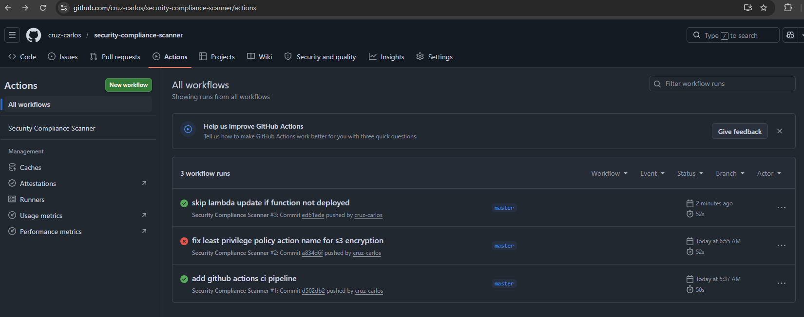
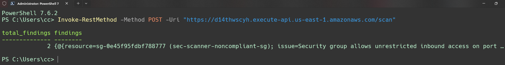
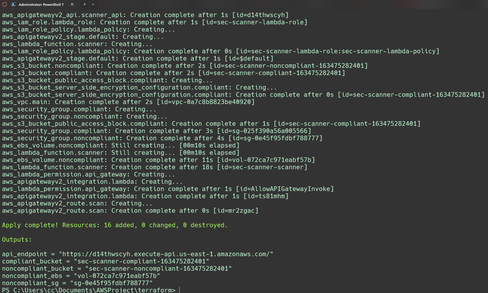

# AWS Security Compliance Scanner

A Python tool that scans AWS infrastructure for common security misconfigurations and auto-remediates the ones it can fix safely. Built to demonstrate DevSecOps practices including infrastructure as code, CI/CD, and least privilege IAM.

---

## Tech Stack

- Python 3.12 with boto3
- Terraform
- Docker
- AWS Lambda and API Gateway
- GitHub Actions

---

## What It Checks

- S3 buckets missing public access blocks or default encryption
- EC2 security groups with unrestricted inbound access on risky ports
- Unencrypted EBS volumes
- Root account access keys

Findings are rated CRITICAL, HIGH, or MEDIUM. HIGH and CRITICAL findings are auto-remediated where safe. MEDIUM findings are flagged for manual review.

---

## How It Works

1. GitHub Actions triggers on every push to master
2. The scanner runs against your AWS account using scoped IAM credentials
3. Findings are saved as a JSON report and uploaded as a pipeline artifact
4. The Docker image is rebuilt and pushed to ECR
5. Lambda is updated with the new image automatically

You can also trigger a scan manually via the API Gateway endpoint:

```
POST https://<your-api-endpoint>/scan
```

---

## Setup

**Prerequisites**

- AWS account with free tier
- Terraform installed
- Docker Desktop installed
- GitHub account

**Steps**

1. Clone the repo
2. Add three GitHub Actions secrets: `AWS_ACCESS_KEY_ID`, `AWS_SECRET_ACCESS_KEY`, `AWS_ACCOUNT_ID`
3. Create an ECR repository named `sec-scanner`
4. Build and push the Docker image to ECR
5. Update `terraform/terraform.tfvars` with your account ID and ECR image URI
6. Run `terraform apply` from the `terraform/` folder
7. Push to master to trigger the pipeline

Always run `terraform destroy` after each session to avoid charges.

---

## Screenshots

**GitHub Actions pipeline**



**API response**



**AWS resources via Terraform**



---

## Security Notes

The Lambda IAM role is scoped to only the API calls the scanner actually makes. No managed policies are attached. The policy was derived from code analysis and validated through live remediation runs.

Root access key findings are flagged but never auto-remediated since removing them requires manual action in the AWS console.